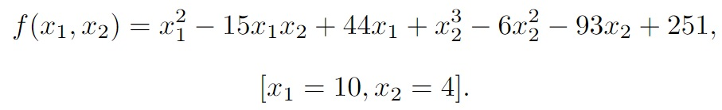
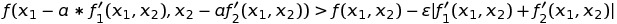
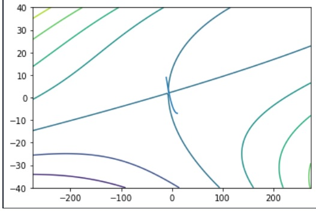

Задание
Найти точку минимума функции 

градиентнымметодом с дроблением шага.В окрестности точки минимума построить линии уровня и траекторию поиска (на одном графике). 

Я использовалe условие предоставленноу в файле
 и формулу
 являющуюся критерием остановки (Градиентный метод с дроблением шага) 

Программу я писал Visual Studio на с++.
Программа находит точку минимума в некторой точке и выводит ее в консоли. Далее записывает результаты своей работы в файл vect.txt.

После чего создав программу на языке python я строил график с полученными данными.
в файле 

# Отчёт по лабораторной работе №6. Безусловный экстремум.
Выполнил студент 429 группы,
Косякин Владимир Владиславович
## Вариант №24

Найти точку минимума функции

градиентным методом с дроблением шага.
В окрестности точки минимума построить линии уровня и траекторию поиска (на одном графике).
# Теоретическая часть

### Градиентный метод с дроблением шага

Если условие 

 

то домножаю шаг(a) на 0.001 (дроблю),после меняю значения точки на значения равные шаг умноженый на частную производную

Критерий остановки:

### Метод случайного поискa

Берём случайную точку в определенном радиусе от изначальной.

Если значение функции в изначальной точке больше, чем во взятой мной случайной точке, то пишем изначальную точку вместо новой и обнавляем счетчик.

Если значение функции в изначальной точке меньше, то убавляем счетчик.

Если значение счетчика достигло 0 (нуля), значит на окружности данного радиуса нет точек оптимальнее данной, значит, оптимум найден.

## Практическая часть

Запускать сначала lab(4).cpp, потом graphick.py

Функции подписаны в самой программе.

### Результаты

В результате работы программы у функции "градиентный метод с дроблением шага" был найден экстремум в точке 3 (начальная точка -11, 9) за 6491 итераций с точностью 0.0001. Ниже приведен рисунок с изображением линий уровня анализируемой функции и траектория поиска экстремума:

У функции "метод случайного поискa" был найден экстрему в точке близкой к 3 (начальная точка -11, 9) за 1000-2000 итераций.
